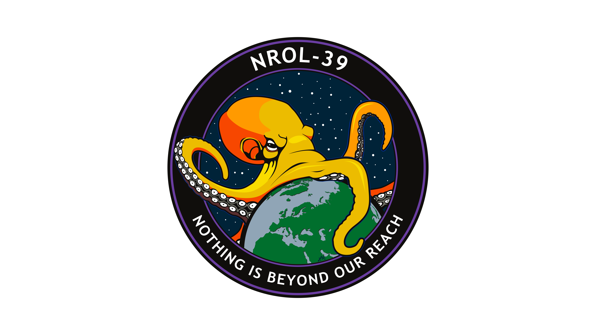

# NROL-39-Wallpaper
An 8k wallpaper derived from the [NROL-39 Mission Patch](https://commons.wikimedia.org/wiki/File:NROL_39_vector_logo.svg), released by the United States National Reconisance office by [Freedom of information act request](https://www.muckrock.com/foi/united-states-of-america-10/nrol-39-mission-logo-78740/#file-817846).
## Black

## Greyscale

## Purple

## White

I created it by taking the SVG form and putting it on a black background in Krita and/or Inkscape.
If someone is better at Inkscape, please take a look at the greyscale version.

